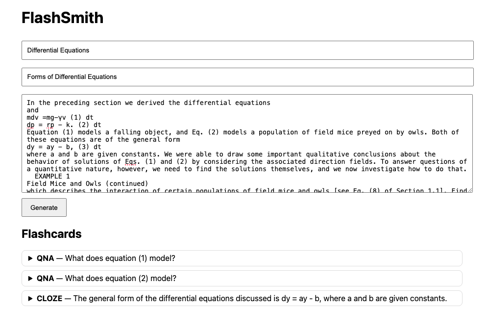

# FlashSmith (Azure)

Paste notes $\rightarrow$ generate flashcards and practice (short/MCQ). Export CSVs for Anki/Quizlet.



**Tech**: FastAPI + Azure AI Foundry serverless model (gpt-35-turbo with JSON mode).

- Serverless endpoint + key auth from Azure AI Foundry Model catalog.  
- Long context (128k) supports full textbook sections.

**Intended Use/Users:** A supplemental study tool for students with already typed notes. Not intended to be a teacher or source of information.

**Safety & Guardrails:** Source prompt requires factual answers with all formulas pasted.

**Limitations/Failure Models:** Gaps in provided information are not filled.

**Evaluation & Quality:** Groundedness checks on test set (sources from differential equations textbook)

## How it works
1. Frontend posts notes/course/topic to `/api/generate`
2. Backend calls Chat Completions with strict JSON prompt
3. UI renders results + provides CSV downloads

## Run
```bash
pip install -r requirements.txt
cp .env.example .env  # fill in endpoint + key
uvicorn app:app --reload --port 8000
```

##